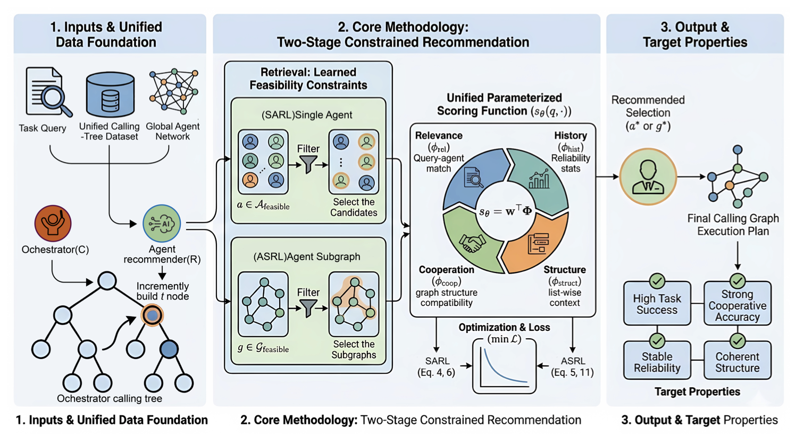
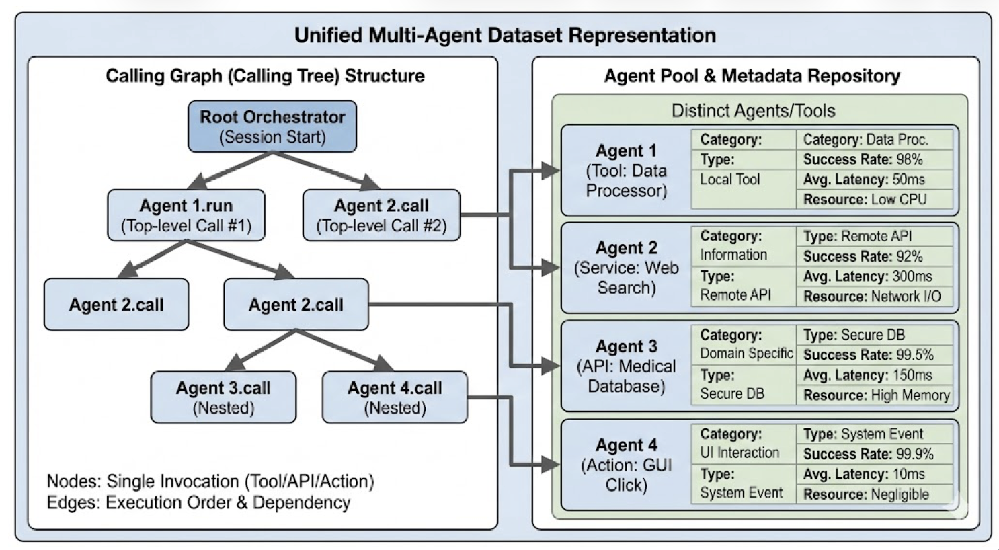

<div align="center">

# Learning to Recommend Multi-Agent Subgraphs from Calling Trees

**Xinyuan Song, Liang Zhao**

[](https://arxiv.org/abs/2601.22209)
[](LICENSE)
[](requirements.txt)

**Official implementation for "Learning to Recommend Multi-Agent Subgraphs from Calling Trees."**

</div>

---

## Overview

Multi-agent systems increasingly solve tasks by selecting agents and tools from
large marketplaces. As these marketplaces grow, recommendation becomes more than
flat item ranking: an orchestrator must choose candidates that are relevant,
reliable, compatible with the current context, and able to cooperate with other
selected agents.

This repository implements the constrained recommendation framework from the
paper. It uses historical **calling trees** to learn from structured execution
traces, including parent-child calls, branching dependencies, and local
cooperation patterns. The framework supports two complementary settings:

| Setting | Goal |
|---------|------|
| **Agent-level recommendation** | Select the next tool or agent for a local subtask. |
| **System-level recommendation** | Select a small connected agent team or subgraph for coordinated execution. |

Both settings use a two-stage pipeline:

1. **Candidate retrieval** builds a compact feasible set conditioned on the
   current subtask and execution context.
2. **Utility optimization** ranks candidates with a learned scorer over
   relevance, reliability, interaction, and structural features.

## Paper Highlights

- Formulates multi-agent recommendation as a constrained decision problem over
  feasible agents or connected agent-system subgraphs.
- Uses historical calling trees as structured supervision, capturing
  parent-child calls, dependency branches, and local cooperation patterns.
- Provides two complementary learning settings: **SARL** for single-agent/tool
  recommendation and **ASRL** for multi-agent subgraph recommendation.
- Normalizes heterogeneous multi-agent invocation logs into a unified
  calling-tree benchmark for systematic evaluation.
- Optimizes selections with interpretable feature families for semantic
  relevance, historical reliability, cooperation, and structure.

## Framework

<p align="center">
  
</p>

The framework starts from a task query, a unified calling-tree dataset, and an
agent pool. It retrieves feasible candidates for either SARL or ASRL, then
reranks them with a shared parameterized scoring function before producing a
recommended agent or final calling-graph execution plan.

## Unified Data Representation

<p align="center">
  
</p>

The normalized data representation connects each calling tree to a metadata-rich
agent/tool repository. Nodes represent concrete invocations, edges encode
execution order or dependencies, and agent metadata provides reliability,
latency, resource, category, and interface signals used by the recommender.

---

## Repository Contents

| Component | Location | Purpose |
|-----------|----------|---------|
| Paper figures | `assets/` | Pipeline and unified data representation figures used in this README. |
| Agent-level recommender | `single agent recommender/` | Tool selection with embedding retrieval and learning-to-rank. |
| System-level recommender | `multi-agent system recommender/` | Calling-tree/subgraph candidate generation, retrieval, and ranking. |
| Dataset notes | `data/README.md` | Format and Hugging Face source for normalized calling-tree corpora. |
| Metrics notes | `LTR_METRICS.md` | Top-1, Top-3, MRR, feature functions, and LTR scoring details. |
| Project notes | `PROJECT_INFO.md` | Additional implementation notes and project structure. |

The code is organized around lightweight scripts rather than a package entry
point, matching the two experimental pipelines used by the paper.

---

## Data

The benchmark uses normalized tool and agent calling graphs from:

[https://huggingface.co/datasets/xsong69/Tool_calling_graphs](https://huggingface.co/datasets/xsong69/Tool_calling_graphs)

Each dataset directory should contain:

```text
tool_pool.json
tool_calling_graphs.json
```

Expected calling-tree format:

```json
{
  "traces": [
    {
      "trace_id": "trace_1",
      "nodes": {
        "node_1": {
          "task": "Task description",
          "input_spec": "{}",
          "output_spec": "result"
        }
      },
      "edges": [["node_1", "node_2"]],
      "decisions": [
        {
          "node": "node_1",
          "candidates": ["tool_1", "tool_2"],
          "chosen": "tool_1"
        }
      ]
    }
  ]
}
```

---

## Installation

```bash
git clone git@github.com:Hik289/Agent_REC.git
cd Agent_REC

python3 -m venv .venv
source .venv/bin/activate
pip install -r requirements.txt
```

Main dependencies include PyTorch, Transformers, Sentence-Transformers,
scikit-learn, NumPy, SciPy, and Matplotlib.

---

## Agent-Level Recommendation

Run embedding-based retrieval:

```bash
cd "single agent recommender"

python tool_selection.py \
    --tool_pool ../data/your_dataset/tool_pool.json \
    --calling_graph ../data/your_dataset/tool_calling_graphs.json \
    --output_dir ../output
```

Train the learning-to-rank scorer:

```bash
python learning_to_rank.py \
    --tool_pool ../data/your_dataset/tool_pool.json \
    --calling_graph ../data/your_dataset/tool_calling_graphs.json \
    --tool_selection ../output/tool_selection_results.json \
    --output_dir ../output
```

Visualize results:

```bash
python visualize_results.py --output_dir ../output
```

---

## System-Level Recommendation

Generate connected candidate subgraphs from calling trees:

```bash
cd "multi-agent system recommender"

python generate_node_candidates.py \
    --tool_pool ../data/your_dataset/tool_pool.json \
    --calling_graph ../data/your_dataset/tool_calling_graphs.json \
    --n_random 20 \
    --output_dir ../output
```

Run graph retrieval:

```bash
python graph_retrieval.py \
    --node_candidates ../output/node_candidates.json \
    --output_dir ../output
```

Train the system-level learning-to-rank scorer:

```bash
python learning_to_rank.py \
    --graph_selection ../output/graph_selection_results.json \
    --node_candidates ../output/node_candidates.json \
    --output_dir ../output
```

Visualize results:

```bash
python visualize_results.py --output_dir ../output
```

---

## Features And Metrics

The learned scoring model uses four feature families:

| Feature | Meaning |
|---------|---------|
| `phi_rel` | Query-candidate semantic relevance. |
| `phi_hist` | Historical reliability from calling traces. |
| `phi_coop` | Compatibility and cooperation with the local execution context. |
| `phi_struct` | Structural utility of the candidate tool, team, or subgraph. |

Evaluation reports:

| Metric | Meaning |
|--------|---------|
| **Top-1 Accuracy** | Fraction of queries where the correct tool or subgraph is ranked first. |
| **Top-3 Accuracy** | Fraction of queries where the correct option appears in the top three. |
| **MRR** | Mean reciprocal rank of the correct option. |

See `LTR_METRICS.md` for implementation details.

---

## Output Files

| Pipeline | Files |
|----------|-------|
| Agent-level | `tool_selection_results.json`, `ltr_model_weights.json`, `ltr_test_results.json` |
| System-level | `node_candidates.json`, `graph_selection_results.json`, `graph_ltr_model_weights.json`, `graph_ltr_test_results.json` |
| Figures | PNG visualizations written by `visualize_results.py` |

---

## Directory Structure

```text
Agent_REC/
|-- README.md
|-- LICENSE
|-- requirements.txt
|-- LTR_METRICS.md
|-- PROJECT_INFO.md
|-- assets/
|   |-- t.png
|   `-- pipeline.png
|-- data/
|-- single agent recommender/
|   |-- tool_selection.py
|   |-- tool_selection_agent.py
|   |-- learning_to_rank.py
|   |-- visualize_results.py
|   `-- visualize_comparison.py
`-- multi-agent system recommender/
    |-- generate_node_candidates.py
    |-- graph_retrieval.py
    |-- graph_retrieval_agent.py
    |-- learning_to_rank.py
    |-- visualize_results.py
    `-- visualize_comparison.py
```

---

## Citation

If you use this code, please cite the paper:

```bibtex
@misc{song2026learningrecommendmultiagent,
  title         = {Learning to Recommend Multi-Agent Subgraphs from Calling Trees},
  author        = {Xinyuan Song and Liang Zhao},
  year          = {2026},
  eprint        = {2601.22209},
  archivePrefix = {arXiv},
  primaryClass  = {cs.MA},
  url           = {https://arxiv.org/abs/2601.22209}
}
```

## License

Released under the [MIT License](LICENSE). Third-party datasets, models, and
libraries used by the experiments are governed by their own licenses and terms.
